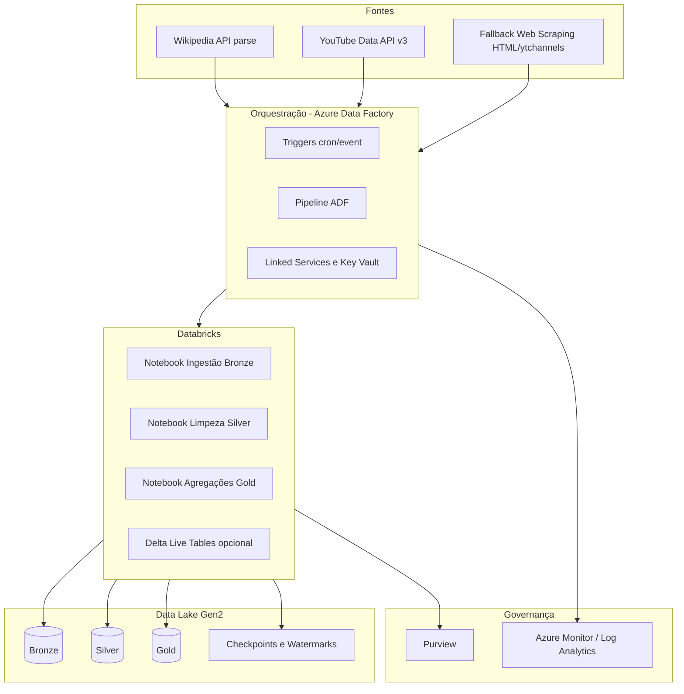
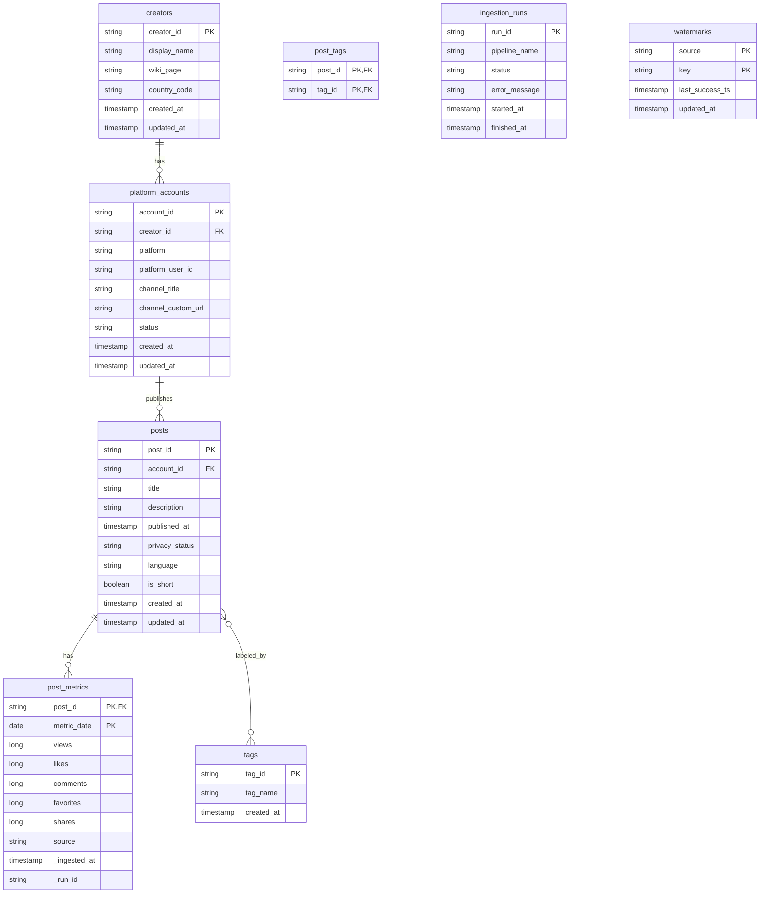

# Parte 2 — Arquitetura e Documentação do Pipeline (Creators & Posts)

> **Objetivo**: Desenhar e documentar um pipeline de dados escalável para ingestão e atualização contínua de dados de *creators* e seus *posts*, **sem** depender dos arquivos JSON da Parte 1. 

---

## 1) Visão Geral da Arquitetura

* **Cloud/Stack-alvo**: Azure + Databricks (PySpark + Delta Lake Gen2)
* **Orquestração**: **Azure Data Factory (ADF)** para agendamento, integração com fontes/APIs e triggers; **Databricks Workflows** (ou Jobs) para orquestrar notebooks/Delta Live Tables nas camadas de transformação.
* **Padrão de camadas**: Medallion (Bronze ➝ Silver ➝ Gold)
* **Controle e Qualidade**: Great Expectations (ou Expectations nativas do Delta/Delta Live Tables), métricas no Azure Monitor/Log Analytics, alertas (ADF + Databricks + Teams/Slack/Email).
* **Governança e Linhagem**: Microsoft Purview + *table properties* e *schema evolution* do Delta Lake.

### 1.1 Diagrama de Arquitetura (Mermaid)



## 2) Orquestrador (Escolha e Por quê)

**Escolha principal: Azure Data Factory (ADF) + Databricks Workflows**

* **ADF** oferece conectores nativos, *retry/exponential backoff*, parametrização, integração com **Key Vault**, gatilhos/schedules e *managed identity*.
* **Databricks Workflows** orquestra tarefas internas (notebooks, DLT, *jobs*) com dependências, *clusters* sob demanda e fácil *observability*.
* Combinação: **ADF** chama **Workflows/Jobs** do Databricks com parâmetros (janelas de tempo, *watermarks*, *backfill*). Escala bem, é nativa no Azure e adere à *stack* de Lakehouse.
* Obs.: se exigido *multi-cloud* e dependências complexas entre domínios, **Airflow** é alternativa, mas não é necessário aqui.

---

## 3) Modelagem de Dados (Relacional + Lakehouse)

### 3.1 Entidades Principais

* **creators**: creator unificado (chave de negócio independente da plataforma)
* **platform\_accounts**: conta do creator por plataforma (ex.: YouTube, TikTok)
* **posts**: conteúdo publicado (vídeos)
* **post\_metrics**: métricas granulares por data (views, likes, comments, etc.)
* **tags**: vocabulário controlado de *tags*
* **post\_tags**: ligação N\:N entre posts e tags
* **ingestion\_runs**: auditoria de execuções/extrações
* **watermarks**: controle de incrementalidade por fonte/entidade

### 3.2 Diagrama ER (Mermaid)



### 3.3 Tabelas por Camada (Delta Lake)

* **Bronze** (raw): `bronze.wikipedia_raw`, `bronze.youtube_channels_raw`, `bronze.youtube_videos_raw`, `bronze.youtube_stats_raw`, `bronze.scrape_youtube_raw`, `bronze.ingestion_logs`
* **Silver** (conformada): `silver.creators`, `silver.platform_accounts`, `silver.posts`, `silver.post_metrics`, `silver.tags`, `silver.post_tags`, `silver.watermarks`
* **Gold** (consumo/analytics): `gold.creator_post_top_likes_6m`, `gold.creator_post_top_views_6m`, `gold.posts_monthly_by_creator`, `gold.creator_kpis_daily` etc.

> **Nota**: *Schema evolution* controlado (Delta Lake), *constraints* lógicas (NOT NULL/PK simuladas em *expectations* + *MERGE* idempotente).

---

## 4) Extração de Dados (Inicial e Incremental)

### 4.1 Fontes e Estratégias

* **Wikipedia API** (`action=parse`) para mapear `wiki_page → platform_user_id (YouTube)`.

  * Ex.: buscar no HTML parseado referências a *YouTube user/channel*.
  * *Fallback*: *scraping* (respeitando robots.txt) da página do *creator* na Wikipedia apenas se API falhar.
* **YouTube Data API v3**

  * **Channels**: metadados do canal (title, customUrl, country, stats)
  * **Search/List** (por `channelId` + `publishedAfter`): vídeos novos/atualizados
  * **Videos** (part=snippet,contentDetails,statistics): detalhes por `videoId`
  * Páginação por `pageToken`, *quotas* gerenciadas, *backoff exponencial*.
* **Scraping (Fallback)**

  * Página pública do canal (HTML/OG tags) para metadados mínimos quando quota excedida (marcar `source=scrape`).

### 4.2 Inicial (*Backfill*)

1. *Seed* de `wiki_page` (lista inicial vinda do negócio/time de produto ou descoberta incremental a partir de curadorias).
2. Resolver `platform_user_id` via Wikipedia API.
3. Coletar **todos** os vídeos históricos por canal em janelas (p.ex. por ano/mês) até o limite desejado.
4. Popular Bronze ➝ normalizar Silver ➝ derivar Gold.

### 4.3 Incremental (*CDC*)

* Usar `publishedAfter = watermark(account_id)` + paginação até esgotar.
* Recoleta de métricas recentes com janelas deslizantes (ex.: últimos 14/30 dias) para capturar deltas em `views/likes/comments`.
* Persistir `watermarks(source=youtube.posts, key=account_id)` por conta.
* Upserts via `MERGE INTO` por `post_id` (e `metric_date` no fato de métricas).

#### Exemplo de lógica (pseudo PySpark/SQL)

```sql
-- Silver.posts (upsert)
MERGE INTO silver.posts AS tgt
USING tmp_posts AS src
ON tgt.post_id = src.post_id
WHEN MATCHED THEN UPDATE SET *
WHEN NOT MATCHED THEN INSERT *;

-- Silver.post_metrics (diária)
MERGE INTO silver.post_metrics AS tgt
USING tmp_metrics AS src
ON tgt.post_id = src.post_id AND tgt.metric_date = src.metric_date
WHEN MATCHED THEN UPDATE SET *
WHEN NOT MATCHED THEN INSERT *;
```

---

## 5) Etapas do Pipeline (Fim a Fim)

1. **Trigger** (ADF): agendamento horário (ou a cada 15 min) + *manual backfill* por parâmetro.
2. **Resolve Accounts** (Databricks - Bronze):

   * Ler `wiki_page` ➝ chamar Wikipedia API ➝ extrair `platform_user_id` (YouTube) ➝ gravar `bronze.*` e *logs*.
3. **Ingest Videos/Channels** (Databricks - Bronze):

   * Para cada `account_id`, chamar YouTube API (respeitando *quota/rate limit*) ➝ gravar *raw*.
4. **Conformar** (Databricks - Silver):

   * *Dedup*, *type casting*, normalização de *tags*, construção de dimensões (`creators`, `platform_accounts`, `posts`).
5. **Métricas** (Silver):

   * Gerar `post_metrics` diária (ou bateladas mais frequentes) com janelas deslizantes.
6. **Servir/Gold**:

   * Tabelas analíticas: *top N por likes/views (6 meses)*, *publicações por mês*, *pivot* por mês etc.
7. **Publicação e Consumo**:

   * Catálogo/Unity Catalog, permissões de leitura, BI (Power BI) conectado ao `gold`.

---

## 6) Monitoramento, Qualidade e Observabilidade

* **Data Quality**

  * Expectations (Great Expectations ou DLT):

    * *Uniqueness*: `posts.post_id` único
    * *Completeness*: `published_at`, `title`, `platform_user_id` não nulos
    * *Referential integrity*: `posts.account_id` ∈ `platform_accounts.account_id`
    * *Range checks*: `views/likes/comments ≥ 0`
    * *Freshness*: *SLA* de chegada (ex.: `max(published_at)` do Silver < 30 min do esperado).
* **Monitoração Operacional**

  * *Run-level* em `ingestion_runs`, *\_run\_id* propagado
  * ADF: alertas por falha, *retry policy*, *timeout*
  * Databricks: *cluster events*, *job runs*, *metrics*
  * Azure Monitor/Log Analytics: *dashboards*, *KQL queries* para DQ/latência/falhas
* **Linhagem e Catálogo**

  * Purview mapeando origem ➝ camadas ➝ tabelas *gold*

---

## 7) Segurança, Custos e Conformidade

* **Segredos**: Azure Key Vault (tokens de API, chaves), *managed identities*
* **RBAC**: AAD grupos, *Unity Catalog* para permissões por esquema/tabela
* **Padrões de rede**: VNET/privatelink quando aplicável
* **Custos**: autoscaling, *spot* quando viável, *auto-termination* de clusters, *partition pruning* e *Z-Order* em Delta

---

## 8) Boas Práticas de Engenharia (Gitflow, CI/CD, Qualidade)

* **Gitflow simplificado**: `main` (prod), `develop` (integração), *feature branches* → PR com *code review* obrigatório
* **CI/CD** (GitHub Actions):

  * *Lint* (ruff/flake8), *format* (black), *unit tests* (pytest)
  * *dbx* ou *Databricks Asset Bundles* para empacotar/deploy de notebooks/jobs/DLT
  * Deploy do **ADF** (ARM/Bicep) e *Linked Services* com *variables* por ambiente
* **IaC**: Terraform/Bicep para ADLS, ADF, Databricks, Key Vault, Purview
* **Testes**:

  * *Unit* (transformações puras), *Contract tests* para APIs (mock de Wikipedia/YouTube)
  * *Integration* (job end-to-end em *qa*), *Data tests* (expectations)
* **Padrões de código**: camadas (`/ingest`, `/transform`, `/serve`), *utils* (retry/backoff, observabilidade), *typed configs* (pydantic)

---

## 9) Especificação das Tabelas (Silver)

### 9.1 `silver.creators`

* `creator_id` (PK, string) — hash estável do `wiki_page` ou ID interno
* `display_name` (string)
* `wiki_page` (string)
* `country_code` (string, ISO-3166-1 alpha-2)
* `created_at`, `updated_at` (timestamp)

### 9.2 `silver.platform_accounts`

* `account_id` (PK, string)
* `creator_id` (FK)
* `platform` (string: `youtube`)
* `platform_user_id` (string)
* `channel_title`, `channel_custom_url` (string)
* `status` (string)
* `created_at`, `updated_at` (timestamp)

### 9.3 `silver.posts`

* `post_id` (PK, string)
* `account_id` (FK)
* `title` (string)
* `description` (string)
* `published_at` (timestamp)
* `privacy_status` (string)
* `language` (string)
* `is_short` (boolean)
* `created_at`, `updated_at` (timestamp)

### 9.4 `silver.post_metrics`

* `post_id` (FK)
* `metric_date` (date)
* `views`, `likes`, `comments`, `favorites`, `shares` (long)
* `source` (string: `api` | `scrape`)
* `_ingested_at` (timestamp), `_run_id` (string)
* **PK composto**: (`post_id`, `metric_date`)

### 9.5 `silver.tags` / `silver.post_tags`

* *Tags* normalizadas com `tag_id` (PK) e `tag_name`; `post_tags` com (`post_id`,`tag_id`)

### 9.6 Operacionais: `silver.ingestion_runs`, `silver.watermarks`

* Executadas por *jobs* para auditoria e controle de incrementalidade.

---

## 10) Padrões de Particionamento e Performance

* **Partition**: `posts` por `published_at` (ano/mês), `post_metrics` por `metric_date`
* **Optimize/Z-Order**: Z-Order por `post_id` e `metric_date`
* **Auto Compaction** e **VACUUM** em janelas seguras

---

## 11) Exemplos de *Jobs* (Databricks Workflows)

1. `00_seed_wiki_pages` (opcional): alimenta *seed* inicial
2. `01_resolve_accounts_from_wikipedia` ➝ Bronze
3. `02_ingest_youtube_channels_and_videos` ➝ Bronze
4. `03_conform_silver_entities` ➝ Silver
5. `04_build_gold_marts` ➝ Gold
6. `90_data_quality_expectations` ➝ validações
7. `99_compact_optimize_vacuum` ➝ manutenção

Cada *job* aceita `--backfill_start`, `--backfill_end`, `--since_watermark`, `--account_id` (opcional) e propaga `_run_id`.

---

## 12) Operação (Runbook)

* **Backfill**: executar `01`, `02` com `--backfill_start=YYYY-MM-DD`, `--backfill_end=YYYY-MM-DD`
* **Reprocessamento**: dropar particões Bronze/Silver afetadas, reexecutar *job*; Gold é *rebuildable*
* **Falhas**: inspecionar `ingestion_runs`, logs do ADF/Databricks; aplicar *retry*. Se quota YouTube excedida ➝ acionar *scrape fallback* e reagendar recomposição de métricas.

---

## 13) Roadmap/Futuros

* Suporte a outras plataformas (TikTok, Instagram) via `platform_accounts`
* *Streaming* com *Autoloader* para *webhooks* ou *event hubs* quando disponível
* Deduplicação semântica por *similarity (title/desc)* e *near real-time* métricas
* *Feature store* para modelos de recomendação/forecast de engajamento

---

---
